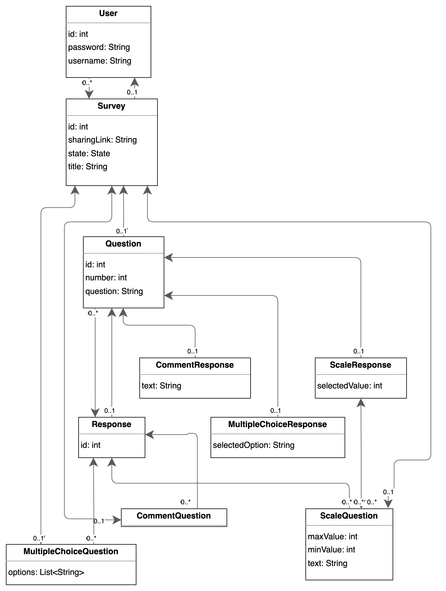
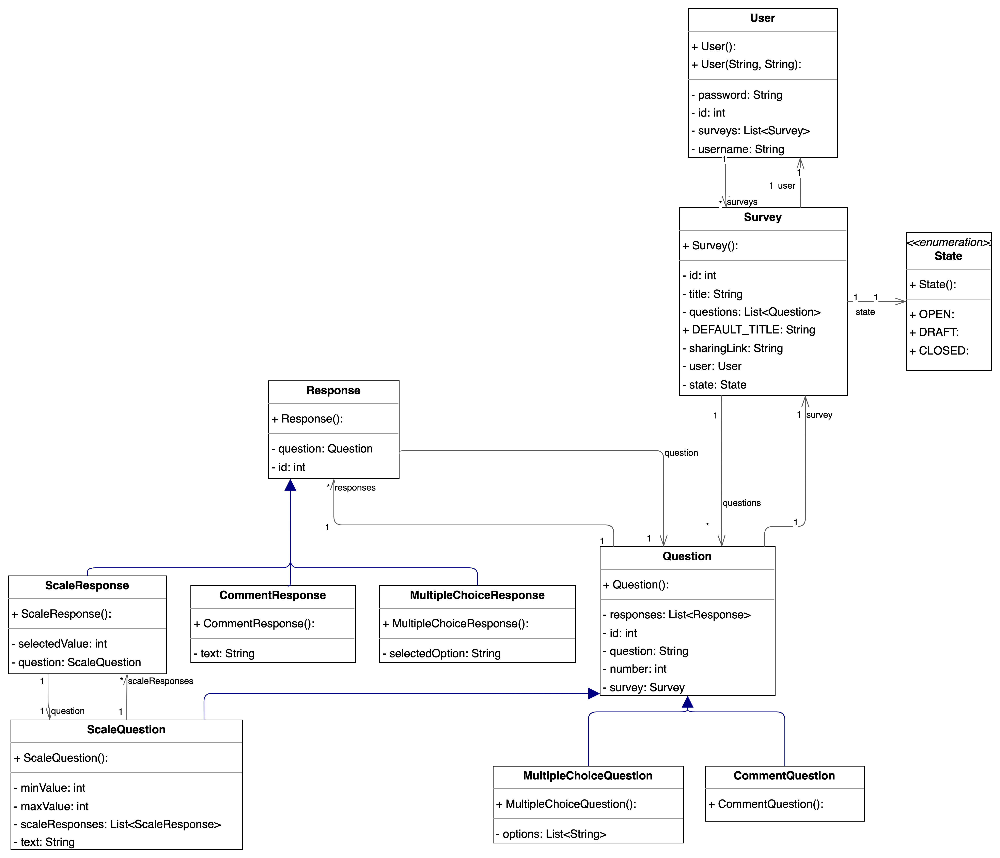

<h1 align="center">
Mini Survey Monkey

  
</h1>

The world's second most popular survey platform.

<a href="https://mini-survey-monkey-eyd6fhfyesf6ezay.canadaeast-01.azurewebsites.net/">🌐 Web App</a> |
<a href="https://mini-survey-monkey-eyd6fhfyesf6ezay.canadaeast-01.azurewebsites.net/banana">🍌 Banana</a>

## Table of contents

Expand contents

- [Current State](#current-state)
- [Scope](#scope)
- [DB schema](#db-schema)
- [UML class Diagram](#uml-class-diagram-for-models)

## Current State
The project now includes a survey management system with user authentication. 
Users can create accounts using unique usernames and log in to their accounts using their corresponding passwords. 
Once logged in, users are directed to a homepage displaying their surveys with the option to create new surveys. 
Surveys include titles, comments, multiple-choice questions, and scale questions. 
Each survey has a defined state (Draft, Open, or Closed).
When a survey is opened a unique, shareable link is generated for collecting responses. 
The system supports storing comment responses in a database.
The summary page for a survey displays questions and all comment responses. 
The application is deployed on Azure with GitHub Actions handling deployment processes.

In Milestone 3, the project will fully support collecting and storing responses for scale questions and multiple-choice questions in the database. 
The analytics page will be completed to include detailed insights for all question types, displaying results and visualizations for scale and multiple-choice questions.

## Scope
*As stated in the project description.*
* Surveyor can create a survey with a list of Questions.
* Questions can be open-ended (text), asking for a number within a range, or asking to choose among many options.  
* Users fill out a survey that is a form generated based on the type of questions in the survey.
* Surveyor can close the survey whenever they want (thus not letting in new users to fill out the survey), and at that point a survey result is generated, compiling the answers: for open-ended questions, the answers are just listed as-is, for number questions a histogram of the answers is generated, for choice questions a pie chart is generated

## DB schema
The following diagram can be updated using the [Diagrams.net Integration IntelliJ Plugin](https://plugins.jetbrains.com/plugin/15635-diagrams-net-integration).

## UML class Diagram for Models
The following diagram can be updated by editing the corresponding drawio file in diagrams and then exporting the drawing
to png.

