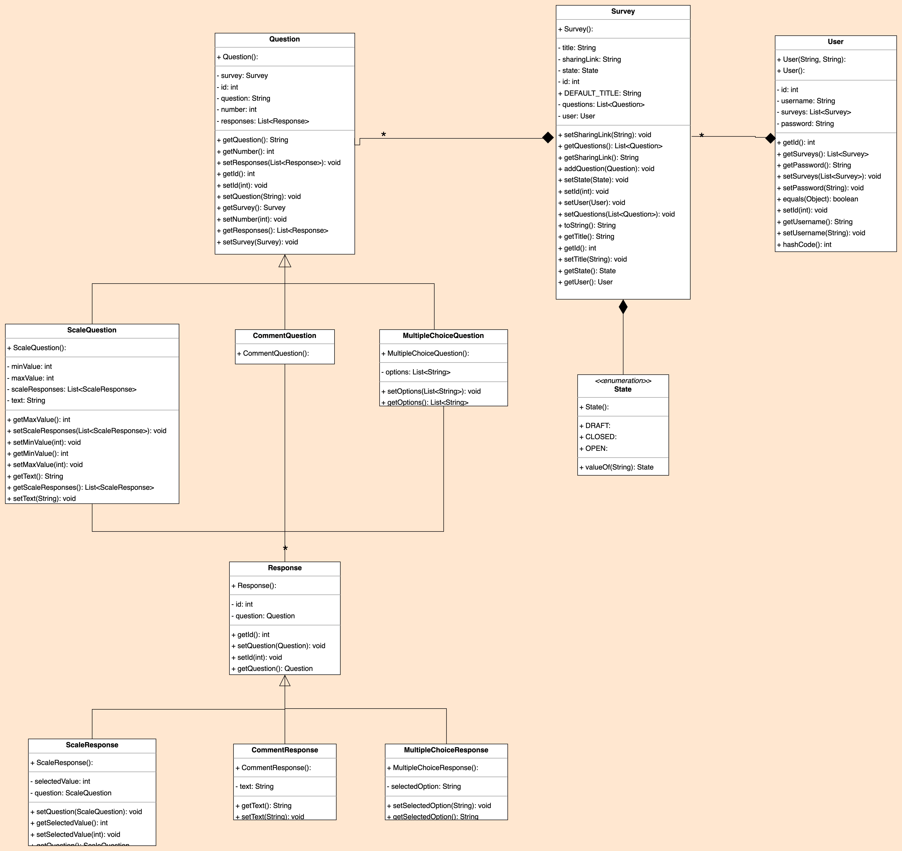

<h1 align="center">
Mini Survey Monkey

  
</h1>

The world's second most popular survey platform.

<a href="https://mini-survey-monkey-eyd6fhfyesf6ezay.canadaeast-01.azurewebsites.net/">🌐 Web App</a> |
<a href="https://mini-survey-monkey-eyd6fhfyesf6ezay.canadaeast-01.azurewebsites.net/banana">🍌 Banana</a>

## Table of contents

Expand contents

- [Description](#description)
- [Deployment](#deployment)
- [Models class diagram](#uml-class-diagram-for-models)
- [DB schema](#db-schema)

## Description
As defined in the project requirements, Mini Survey Monkey is a survey management system where:
* Surveyors can create a survey with a list of questions.
* Questions can be open-ended (text), asking for a number within a range, or asking to choose among many options.
* Users fill out a survey that is a form generated based on the type of questions in the survey.
* Surveyor can close the survey whenever they want (thus not letting in new users to fill out the survey)
* Generate survey results, compiling the answers: for open-ended questions, the answers are just listed as-is, for number questions a histogram of the answers is generated, for choice questions a pie chart is generated

Additionally, users can:
* Create accounts using unique usernames and log in to their accounts using their corresponding passwords.
* Share surveys with a unique, generated link for collecting responses.

## Deployment
The application is deployed on Azure with GitHub Actions handling deployment processes.

## Models class diagram
The following image a UML class diagram of the models implemented in the system.

## DB schema
The following image is the DB schema of our system.

